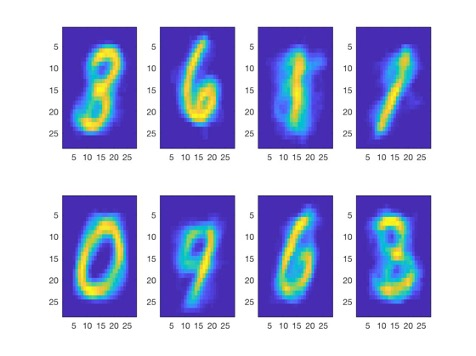

# CSE 326 - Machine Learning

## Course Overview

An introductory course offers a broad overview of the main techniques in machine learning. Students will study the basic concepts of advanced machine learning methods as well as their theoretical background. Topics of learning theory (bias/variance tradeoffs; VC theory); supervised learning parametric/nonparametric methods, Bayesian models, support vector machines, neural networks); unsupervised learning (dimensionality reduction, kernel tricks, clustering) and reinforcement learning will be covered. 

## Content Information

This repository contains MATLAB scripts created for Lehigh University's CSE 326 (Foundations of Machine Learning) - Spring of 2018

Topics covered:

* Linear Regression
* K Means using MNIST Data set
* Gaussean Mixture Models using MNIST and ORL data sets
* Dimensionality Reduction using Principal Component Analysis (PCA) and Fast Fourier Transfomrs
* Neural Networks

Here's a cool Image from one of the Reports:

